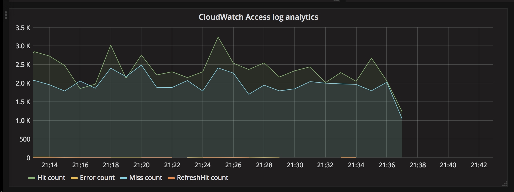
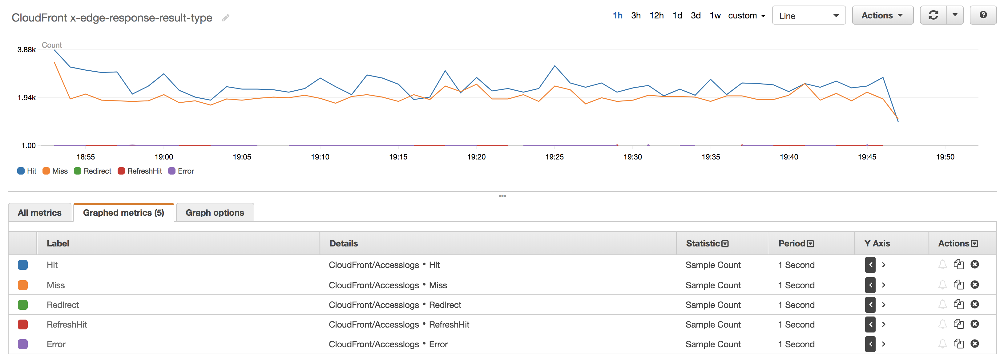

Cloudfront access logs to CloudWatch custom metrics
====

CloudFront has some nice statistics burried within console, unfortunetly no programmatical access to those data or exposure to CloudWatch is offered.
But I wanted to complement our Grafana based monitoring with some metrics from data available only via console. 

As CloudFront offers to push it's accesss logs to S3 bucket of your choise, a little utility handling this data can fill the metrics gap.

Contents
----
- app.py - little & easy to extend Lambda function taking access logs as input and pushing per line entries to CloudWatch
- sam.yml - Serverless Application Model template, head to their doc to get started with deployment.

Features
----
- Adds to CloudWatch metrics for Hit / RefreshHit / Miss / LimitExceeded / CapacityExceeded / Error / Redirect count, can be later seen as SampleCount in graphs;
- With few lines of code you should be able to add other metrics if desired;

Install
----
- Create bucket for code or specify existing one in next step (CodeUri): `aws s3 mb s3://<bucket-name-where-code-should-be-stored>`
- Upload code, generate CloudFormation: `sam package --template-file template.yml --s3-bucket <bucket-name-where-code-should-be-stored> --output-template-file cloudformation.yml`
- Deploy CloudFormation stack: `aws cloudformation deploy --template-file path/to/cloudformation.yml --stack-name <cf-stack-name> --capabilities CAPABILITY_IAM`
- Configure yout CloudFront distriubtion to write logs to just deployed S3 bucket by enabling Logging under it's generic settings
- If all is good, you should see something like this in CloudWatch logs (for Lambda): `Access log XXXXXXXXXXXXXX.2018-02-23-19.bd7ae1f4.gz originating from targetbucket-xxxxxxx with 22347 lines was parsed and pushed to CloudWatch`

Note
----
- This SAM template will deploy CloudFormation stack which will consist of Lambda Function and S3 Bucket + suplimentary stuff like execution roles, etc.
- It is expected, that once this stack is deployed, CloudFront access logs should be configured to be pushed to created S3 Bucket. 
- Consider need to improve performance of this Lambda otherwise for very busy CloudFront distributions, you might reach timeout. Current performance is about 0.83 lines of CSV per ms aka 25 000 lines takes ~30 seconds of Lambda exec time.
- Mind quite allowing policies given to Lambda, in more strict environment that should be modified.

Seeing is believing
----

- normally I observe 5-15 min floating delay for data with this approach